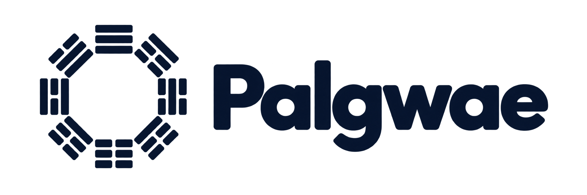
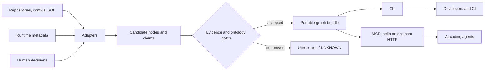

# Palgwae

<p align="center">
  
</p>

**Untangle the eightfold complexity of data pipelines.**

Palgwae is an evidence-bounded context graph for data pipelines, the
repositories that define them, and the developers and agents that need to
change them safely.

> **Eight views. One provable flow.**

### The idea behind the name

We take inspiration from *palgwae* (팔괘/八卦), the eight trigrams, as a way of
reading a complex world through a small vocabulary of simple forms. Solid and
broken lines gain meaning through their combinations and relationships. The
simplicity is in the language, not in the world it describes.

Palgwae brings that intention to software repositories. ELT jobs, Airflow DAGs,
tables, configuration, and cross-repository dependencies are pieces of a
larger system. We make their relationships explicit, evidence-backed, and
readable, so developers and agents can understand the whole without repeatedly
reconstructing it from scattered source files. Simplifying the representation
must not mean hiding uncertainty or inventing missing connections.

The logo follows the same principle: the trigrams themselves carry the idea
of relationships. Their arrangement, repetition, and negative space express
complexity through simple forms; no separate network diagram is needed.

Our eight engineering views are a modern application of this inspiration—not
a one-to-one mapping to the traditional meanings of the trigrams:

1. data flow;
2. control flow;
3. infrastructure;
4. contracts;
5. runtime state;
6. lifecycle;
7. cross-repository ownership;
8. evidence and trust.

Together they expose dependencies that disappear when lineage, orchestration,
deployment, and operational knowledge are inspected separately. See the
[Eightfold Context Model](docs/eightfold-context-model.md).

The project is deliberately small:

- local JSONL files instead of a required graph database;
- deterministic traversal instead of an LLM in the query path;
- every accepted edge points to source evidence;
- `UNKNOWN` means "not proven", never "does not exist";
- CLI and Model Context Protocol (MCP) access use the same graph bundle.

No API key, embedding model, vector database, or cloud account is required.
The optional Graphify adapter is build-time only and never enters the MCP
runtime dependency set.

> Status: early alpha. The first release proves the file contracts,
> evidence rules, traversal behavior, and a generic retail-pipeline example.

## Why Palgwae?

Code graphs are good at calls, imports, and symbols. Data catalogs are good at
datasets, ownership, and observed lineage. A data engineering change often
crosses both:

```text
schedule -> orchestrator -> job -> queue -> job -> dataset
                                      |
                                      +-> marker/contract -> service
```

The missing context is usually the binding among all eight views. Palgwae keeps
those relationships together and makes the evidence behind each relationship
retrievable.

It complements tools such as OpenLineage, DataHub, OpenMetadata, dbt, and code
knowledge graphs. Future adapters can ingest their metadata; this project does
not try to replace them. See [prior art and boundaries](docs/prior-art.md).

## How it works



The graph bundle contains:

```text
graph/
  nodes.jsonl       canonical entities
  claims.jsonl      typed relationships
  evidence.jsonl    pinned source provenance
  unresolved.jsonl  boundaries that remain unproven
  manifest.json     graph hashes, snapshot identity, and ontology hashes
```

See [the Eightfold Context Model](docs/eightfold-context-model.md) for the
concept, [the methodology](docs/methodology.md) for the acceptance rubric, and
[the ontology guide](docs/ontology.md) for relation direction.

For a zero-server view, open `web/explorer.html` and select `manifest.json`
plus the bundle's four JSONL files. The static explorer verifies their hashes,
has no external dependencies, and uploads nothing.

## Quick start

Want your agent to handle setup? Copy the
[one-go installation prompt](#one-go-setup-prompt-for-an-ai-agent) from your
owner-project workspace. For manual setup, start below.

Requirements: Python 3.11+ and [uv](https://docs.astral.sh/uv/).

```bash
git clone https://github.com/yonghyeokrhee/Palgwae.git
cd Palgwae
uv sync --frozen

# Build the bundled fictional retail example.
uv run palgwae build examples/retail_pipeline/context-graph.yaml \
  --output .palgwae/demo

# Fail closed if files or evidence no longer match the manifest.
uv run palgwae doctor --bundle .palgwae/demo

# Run the executable retrieval contract.
uv run palgwae eval --bundle .palgwae/demo \
  --golden examples/retail_pipeline/golden.yaml

# Resolve a name before traversing.
uv run palgwae find orders_daily --bundle .palgwae/demo

# Follow an evidence-backed blast radius.
uv run palgwae downstream urn:example:palgwae:demo:dataset:orders-daily \
  --bundle .palgwae/demo --max-hops 4
```

The `urn:example:palgwae:*` IDs above are fictional fixture identifiers. Real
adapters must use a canonical URI namespace controlled by the deploying
organization.

Start an MCP server for any compatible coding agent:

```bash
# One process per agent, no open port.
uv run palgwae mcp --bundle .palgwae/demo --transport stdio

# Or a shared loopback endpoint.
uv run palgwae mcp --bundle .palgwae/demo \
  --transport http --host 127.0.0.1 --port 8765
```

Generic MCP client configuration:

```json
{
  "mcpServers": {
    "palgwae": {
      "command": "uv",
      "args": [
        "run",
        "--frozen",
        "--project",
        "/absolute/path/to/Palgwae",
        "palgwae",
        "mcp",
        "--bundle",
        "/absolute/path/to/bundle",
        "--transport",
        "stdio"
      ]
    }
  }
}
```

Palgwae also ships thin distributions for
[Codex, Claude Code, and OpenCode](docs/cross-agent-plugins.md). They all start
the same stdio MCP server and apply the same evidence-bounded query contract;
the client-specific files contain installation metadata and workflow guidance,
not graph semantics.

The Codex plugin is plug-and-play from a source marketplace: it includes its
own Palgwae Python runtime, so a separate global `palgwae` installation is not
required. On first use it initializes `.palgwae/bundle` in the owner project.
A conventional `palgwae-context-graph.yaml` (or `.yml`/`.json`) is compiled
automatically. If no spec exists, Palgwae creates a valid fail-closed starter
with one repository node, zero accepted claims, and an explicit unresolved
boundary. The starter makes MCP available immediately without pretending that
repository relationships were extracted.

## Install in your project

The **owner project** is the repository whose pipelines you want to query;
it is separate from the Palgwae checkout. The commands below use the source
checkout from Quick start, not a package assumed to exist on PyPI. For
reproducible installations, check out a reviewed Palgwae commit and keep its
`uv.lock` unchanged.

```bash
# Replace these with absolute paths. No global palgwae command is needed.
PALGWAE_DIR="/absolute/path/to/Palgwae"
OWNER_DIR="/absolute/path/to/your-project"

uv sync --frozen --project "$PALGWAE_DIR"
uv run --frozen --project "$PALGWAE_DIR" palgwae bootstrap \
  --project-root "$OWNER_DIR" --output .palgwae/bundle
uv run --frozen --project "$PALGWAE_DIR" palgwae doctor \
  --bundle "$OWNER_DIR/.palgwae/bundle"
```

Bootstrap reuses a valid existing bundle, compiles a conventional project spec
when the bundle is missing, or creates the empty starter described above.
**It does not automatically extract pipeline relationships from arbitrary
source code.** Use the agent prompt below to prepare that evidence-backed
context, or write an [adapter](docs/writing-an-adapter.md).

To connect, use the generic MCP configuration above with your absolute
Palgwae path and `OWNER_DIR/.palgwae/bundle` as the bundle path. These are literal
paths in JSON, not shell variables. Use your client's native configuration
format; merge the Palgwae entry without replacing other servers. If the client
cannot find `uv`, set `command` to its absolute executable path. Alternatively,
follow the [client-specific plugin installation](docs/cross-agent-plugins.md).
Restart or reconnect MCP after changing the bundle: the server loads its
snapshot at startup.

### One-go setup prompt for an AI agent

Open the **owner project** in your coding agent and paste the following prompt.
It authorizes local setup and verification, not production execution or
publishing. The agent needs shell/file access and permission to update the
chosen MCP configuration. A client that cannot reload tools during a session
may still require a reconnect or a new session.

```text
Install and connect Palgwae to this owner project, then prove that its MCP
tools can answer a real pipeline question. Execute the work, not just a plan.

1. Resolve the current workspace's owner-project root. Inspect its instructions,
   Git status, and existing Palgwae/MCP configuration. Preserve unrelated edits,
   existing curated graphs, and other MCP servers. Do not run ETL jobs, access
   production services, read secrets, upload source, commit, or push.

2. Reuse an existing Palgwae checkout, or clone
   https://github.com/yonghyeokrhee/Palgwae.git into a separate tools directory
   outside the owner repository. Read its README, docs/methodology.md,
   docs/ontology.md, docs/writing-an-adapter.md, and the retail example spec and
   Golden tests. Record the Palgwae revision and any local modifications. Use
   the requested revision if one was supplied; do not reset an existing checkout.

3. Check Python 3.11+ and uv. If missing, install them using the platform's
   supported official instructions and the environment's approval policy.
   Resolve absolute PALGWAE_DIR and OWNER_DIR paths, then run:
     uv sync --frozen --project "$PALGWAE_DIR"
     uv run --frozen --project "$PALGWAE_DIR" palgwae bootstrap --help
     uv run --frozen --project "$PALGWAE_DIR" palgwae bootstrap \
       --project-root "$OWNER_DIR" --output .palgwae/bundle
   If this revision lacks bootstrap, report the version mismatch instead of
   inventing a command. A starter with zero accepted claims is not completion.

4. Reuse a suitable existing spec, or inspect the owner's source, SQL, schedules,
   and configuration to model one representative end-to-end pipeline. Create
   palgwae-context-graph.yaml at the owner root without overwriting existing
   work. Set SPEC_PATH to the absolute path of the reused or new spec.
   Use organization-controlled canonical URIs, never fictional example
   IDs; ask only if the namespace or an essential identity is ambiguous.
   Resolve ontology and evidence paths relative to the spec. Pin the actual
   source revision and exact line ranges; disclose dirty-source provenance.
   Follow the acceptance rubric: a valid locator alone does not prove a
   relationship. Do not mark model guesses as AUTO_VERIFIED or invent human
   approval. Keep dynamic targets and unsupported relationships unresolved.

5. Build into a new, unused owner-local bundle directory so existing snapshots
   remain intact. Resolve its absolute path as BUNDLE_DIR, then run:
     uv run --frozen --project "$PALGWAE_DIR" palgwae build \
       "$SPEC_PATH" --output "$BUNDLE_DIR"
     uv run --frozen --project "$PALGWAE_DIR" palgwae doctor --bundle "$BUNDLE_DIR"
   Create owner-specific Golden tests for entity resolution, a source-supported
   path, and an unproven query that must return UNKNOWN. Run palgwae eval with
   --bundle "$BUNDLE_DIR" and --golden pointing to those tests. Do not copy the
   fictional example's expected answers. Bootstrap does not refresh an existing
   bundle; use an explicit build when the spec changes.

6. Detect the current MCP client and merge a project-scoped Palgwae server entry
   using its supported configuration format. Launch the absolute uv executable
   with arguments:
     run --frozen --project <absolute PALGWAE_DIR> palgwae mcp
     --bundle <absolute BUNDLE_DIR> --transport stdio
   Substitute actual paths, not placeholders or shell variables. Preserve other
   settings and avoid duplicate Palgwae servers. Prefer project scope; ask before
   changing shared user-wide configuration if project scope is unavailable.

7. Reconnect and test through MCP, not CLI queries alone: initialize, list the
   seven documented tools, call graph_health, resolve a real entity with
   find_entity, traverse a supported path, and call get_claim_evidence for a
   returned claim. Check that MCP reports the validated bundle's snapshot.
   If this session cannot reload its tools, test the configured command through
   an MCP SDK stdio client and separately state that host-client activation is
   pending. Do not claim live integration based only on a config file or doctor.

8. Answer one real owner-project lineage or change-impact question using MCP
   evidence, with source locators and unresolved boundaries. Finish with the
   changed paths, revisions, snapshot ID, node/accepted-claim/unresolved counts,
   doctor and Golden results, actual MCP calls tested, and any exact reconnect
   action still needed. Distinguish installation, populated context, protocol
   verification, and host-client activation. If evidence or permissions block
   a step, report the partial result honestly and the smallest next action.
```

## Performance comparison

An early matched-model pilot compared two ways for an AI coding agent to answer
the same multi-part lineage and change-impact question in a real-world AWS Glue
ETL repository:

1. **Search only:** inspect a clean, tracked-only checkout with ordinary source
   search and file reads.
2. **Palgwae MCP:** query a prebuilt accepted graph, then retrieve the pinned
   evidence for material relationships.

Both runs used `gpt-5.6-terra` with medium reasoning and ran sequentially. The
task required the agent to trace a raw report through its producer, every
producer output, a downstream consumer and its schedule, and the final MySQL
dataset; cite file and line evidence; identify unresolved boundaries; and
assess an intermediate schema change.

| Metric | Search only | Palgwae MCP | Difference |
|---|---:|---:|---:|
| Wall time | 91.24 s | 65.87 s | **27.8% faster** |
| Input tokens | 319,849 | 253,996 | **20.6% fewer** |
| Output tokens | 3,842 | 2,633 | **31.5% fewer** |
| Shell commands | 7 | 3 | **57.1% fewer** |

Both runs recovered the core four-hop data path, all four producer outputs,
the consumer schedule, and source locators. The MCP result additionally bound
the answer to a validated snapshot and returned explicit evidence and
unresolved records. The search-only result found producer-control details that
were outside the pilot graph and provided deeper field-level schema analysis.

The practical result is intentionally narrower than “MCP beats search”:

- Palgwae improved latency, context usage, and reproducibility for relationships
  already represented in the accepted graph.
- Source search remained necessary for facts outside the bundle and for semantic
  code analysis below the modeled relationship level.
- Graph extraction, review, and bundle-build time were not included. The
  comparison measures query-time agent performance after the Palgwae context
  has been prepared.
- This was one representative task with one run per arm, not a statistical
  benchmark. Treat the numbers as an initial case study and reproduce the
  comparison on your own repositories and questions.

## Optional Graphify candidate extraction

Graphify can expand candidate coverage across code repositories without
becoming a source of accepted truth. Its dependency is isolated under
`integrations/graphify` with a separate lockfile:

```bash
cd integrations/graphify
uv sync --frozen
uv run palgwae-graphify --help
```

The adapter always emits a candidate ledger with zero accepted claims.
Canonical identity resolution and predicate-specific verification remain
Palgwae responsibilities. See the
[Graphify integration boundary](docs/graphify-integration.md).

## MCP tools

The server is read-only:

| Tool | Purpose |
|---|---|
| `graph_health` | Verify snapshot identity and file hashes |
| `find_entity` | Resolve names and aliases to canonical IDs |
| `get_upstream` | Return evidence-backed upstream paths |
| `get_downstream` | Return evidence-backed downstream paths |
| `find_dependency_path` | Explain a path between two entities |
| `assess_change_impact` | Summarize direct and transitive impact |
| `get_claim_evidence` | Return the provenance of one claim |

Agent rule: call `find_entity` first. A traversal that returns `UNKNOWN` has
insufficient accepted evidence; it is not proof that no dependency exists.

## What belongs in the graph?

The default ontology covers the Eightfold Context Model:

- data and control flow;
- infrastructure and environments;
- message, data, marker, and argument contracts;
- runtime observations and lifecycle assertions;
- repositories, services, and cross-repository ownership;
- evidence records, review status, and unresolved boundaries.

An edge is accepted only when its endpoints are canonical, the relation is
allowed by the ontology, and its evidence is pinned to a reproducible source.
Narrative documentation and runtime activity are valuable evidence, but neither
automatically proves a source-code dependency.

## Start contributing

The project intentionally begins with one adapter-neutral spec and one demo.
Useful first contributions are small:

- an OpenLineage event adapter;
- dbt `manifest.json` ingestion;
- Airflow DAG and task extraction;
- SQL table/column lineage;
- Terraform resource bindings;
- a candidate-claim review UI;
- predicate-specific candidate promotion verifiers;
- more Golden questions and negative tests.

Read [CONTRIBUTING.md](CONTRIBUTING.md) and
[the roadmap](docs/roadmap.md). Please propose one evidence rule or adapter at
a time so its trust boundary stays reviewable.

## Author

Created by Yonghyeok Rhee.

[LinkedIn](https://www.linkedin.com/in/yong) ·
[Blog](https://yonghyeokrhee.github.io/)

## License

Apache License 2.0. See [LICENSE](LICENSE).
