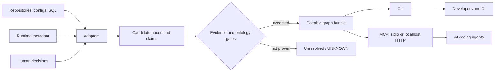

# Palgwae

**Untangle the eightfold complexity of data pipelines.**

Palgwae is an evidence-bounded context graph for data pipelines, the
repositories that define them, and the developers and agents that need to
change them safely.

> **Eight views. One provable flow.**

The name is inspired by *palgwae* (팔괘/八卦), the eight trigrams and their
combinatorial view of changing relationships. Palgwae's eight engineering
views are a modern metaphor—not a claim that these categories are the
traditional meanings of the trigrams:

1. data flow;
2. control flow;
3. infrastructure;
4. contracts;
5. runtime state;
6. lifecycle;
7. cross-repository ownership;
8. evidence and trust.

Together they expose dependencies that disappear when lineage, orchestration,
deployment, and operational knowledge are inspected separately. See the
[Eightfold Context Model](docs/eightfold-context-model.md).

The project is deliberately small:

- local JSONL files instead of a required graph database;
- deterministic traversal instead of an LLM in the query path;
- every accepted edge points to source evidence;
- `UNKNOWN` means "not proven", never "does not exist";
- CLI and Model Context Protocol (MCP) access use the same graph bundle.

No API key, embedding model, vector database, or cloud account is required.
The optional Graphify adapter is build-time only and never enters the MCP
runtime dependency set.

> Status: early alpha. The first release proves the file contracts,
> evidence rules, traversal behavior, and a generic retail-pipeline example.

## Why Palgwae?

Code graphs are good at calls, imports, and symbols. Data catalogs are good at
datasets, ownership, and observed lineage. A data engineering change often
crosses both:

```text
schedule -> orchestrator -> job -> queue -> job -> dataset
                                      |
                                      +-> marker/contract -> service
```

The missing context is usually the binding among all eight views. Palgwae keeps
those relationships together and makes the evidence behind each relationship
retrievable.

It complements tools such as OpenLineage, DataHub, OpenMetadata, dbt, and code
knowledge graphs. Future adapters can ingest their metadata; this project does
not try to replace them. See [prior art and boundaries](docs/prior-art.md).

## How it works



The graph bundle contains:

```text
graph/
  nodes.jsonl       canonical entities
  claims.jsonl      typed relationships
  evidence.jsonl    pinned source provenance
  unresolved.jsonl  boundaries that remain unproven
  manifest.json     graph hashes, snapshot identity, and ontology hashes
```

See [the Eightfold Context Model](docs/eightfold-context-model.md) for the
concept, [the methodology](docs/methodology.md) for the acceptance rubric, and
[the ontology guide](docs/ontology.md) for relation direction.

For a zero-server view, open `web/explorer.html` and select `manifest.json`
plus the bundle's four JSONL files. The static explorer verifies their hashes,
has no external dependencies, and uploads nothing.

## Quick start

Requirements: Python 3.11+ and [uv](https://docs.astral.sh/uv/).

```bash
git clone https://github.com/yonghyeokrhee/Palgwae.git
cd Palgwae
uv sync --frozen

# Build the bundled fictional retail example.
uv run palgwae build examples/retail_pipeline/context-graph.yaml \
  --output .palgwae/demo

# Fail closed if files or evidence no longer match the manifest.
uv run palgwae doctor --bundle .palgwae/demo

# Run the executable retrieval contract.
uv run palgwae eval --bundle .palgwae/demo \
  --golden examples/retail_pipeline/golden.yaml

# Resolve a name before traversing.
uv run palgwae find orders_daily --bundle .palgwae/demo

# Follow an evidence-backed blast radius.
uv run palgwae downstream urn:example:palgwae:demo:dataset:orders-daily \
  --bundle .palgwae/demo --max-hops 4
```

The `urn:example:palgwae:*` IDs above are fictional fixture identifiers. Real
adapters must use a canonical URI namespace controlled by the deploying
organization.

Start an MCP server for any compatible coding agent:

```bash
# One process per agent, no open port.
uv run palgwae mcp --bundle .palgwae/demo --transport stdio

# Or a shared loopback endpoint.
uv run palgwae mcp --bundle .palgwae/demo \
  --transport http --host 127.0.0.1 --port 8765
```

Generic MCP client configuration:

```json
{
  "mcpServers": {
    "palgwae": {
      "command": "uv",
      "args": [
        "run",
        "--project",
        "/absolute/path/to/Palgwae",
        "palgwae",
        "mcp",
        "--bundle",
        "/absolute/path/to/bundle",
        "--transport",
        "stdio"
      ]
    }
  }
}
```

Palgwae also ships thin distributions for
[Codex, Claude Code, and OpenCode](docs/cross-agent-plugins.md). They all start
the same stdio MCP server and apply the same evidence-bounded query contract;
the client-specific files contain installation metadata and workflow guidance,
not graph semantics.

## Optional Graphify candidate extraction

Graphify can expand candidate coverage across code repositories without
becoming a source of accepted truth. Its dependency is isolated under
`integrations/graphify` with a separate lockfile:

```bash
cd integrations/graphify
uv sync --frozen
uv run palgwae-graphify --help
```

The adapter always emits a candidate ledger with zero accepted claims.
Canonical identity resolution and predicate-specific verification remain
Palgwae responsibilities. See the
[Graphify integration boundary](docs/graphify-integration.md).

## MCP tools

The server is read-only:

| Tool | Purpose |
|---|---|
| `graph_health` | Verify snapshot identity and file hashes |
| `find_entity` | Resolve names and aliases to canonical IDs |
| `get_upstream` | Return evidence-backed upstream paths |
| `get_downstream` | Return evidence-backed downstream paths |
| `find_dependency_path` | Explain a path between two entities |
| `assess_change_impact` | Summarize direct and transitive impact |
| `get_claim_evidence` | Return the provenance of one claim |

Agent rule: call `find_entity` first. A traversal that returns `UNKNOWN` has
insufficient accepted evidence; it is not proof that no dependency exists.

## What belongs in the graph?

The default ontology covers the Eightfold Context Model:

- data and control flow;
- infrastructure and environments;
- message, data, marker, and argument contracts;
- runtime observations and lifecycle assertions;
- repositories, services, and cross-repository ownership;
- evidence records, review status, and unresolved boundaries.

An edge is accepted only when its endpoints are canonical, the relation is
allowed by the ontology, and its evidence is pinned to a reproducible source.
Narrative documentation and runtime activity are valuable evidence, but neither
automatically proves a source-code dependency.

## Start contributing

The project intentionally begins with one adapter-neutral spec and one demo.
Useful first contributions are small:

- an OpenLineage event adapter;
- dbt `manifest.json` ingestion;
- Airflow DAG and task extraction;
- SQL table/column lineage;
- Terraform resource bindings;
- a candidate-claim review UI;
- predicate-specific candidate promotion verifiers;
- more Golden questions and negative tests.

Read [CONTRIBUTING.md](CONTRIBUTING.md) and
[the roadmap](docs/roadmap.md). Please propose one evidence rule or adapter at
a time so its trust boundary stays reviewable.

## License

Apache License 2.0. See [LICENSE](LICENSE).
