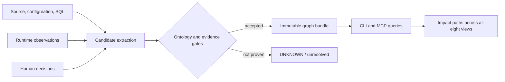

# The Eightfold Context Model

Palgwae helps developers untangle a pipeline by examining eight connected
views instead of reducing the system to SQL lineage or code calls.

> **Eight views. One provable flow.**

## Why the name?

The name *Palgwae* is inspired by 팔괘/八卦—the eight trigrams and their
combinatorial view of changing relationships. In this project, "eightfold" is
a modern engineering metaphor for looking at one data system through eight
interdependent views.

The categories below are **not** presented as the traditional meanings of the
eight trigrams. Palgwae does not implement or interpret a spiritual,
philosophical, or divination system. The name acknowledges the useful idea that
a small set of perspectives can combine to reveal a complex, changing whole.

## The eight views

| View | Question it answers | Typical graph facts |
|---|---|---|
| Data flow | What data is read, transformed, and written? | job `READS_FROM` dataset; job `WRITES_TO` dataset |
| Control flow | What schedules, starts, invokes, or queues work? | trigger `SCHEDULES` task; task `STARTS` job |
| Infrastructure | Where and through which deployed resources does it run? | resource `DEPLOYED_IN` environment; producer `ENQUEUES_TO` queue |
| Contracts | What must be emitted, consumed, or kept invariant? | job `EMITS` marker; service `REQUIRES` contract |
| Runtime state | What was observed to run, and when? | a time-scoped observation linked to pinned runtime evidence |
| Lifecycle | Which path is declared, deployed, authoritative, replaced, or retired? | successor `REPLACES` predecessor; reviewed lifecycle assertion |
| Cross-repository ownership | Which repository or team defines each side of a dependency? | job `OWNED_BY` repository; path crosses repository boundaries |
| Evidence and trust | Why should an edge be believed, and what remains unknown? | claim evidence, review status, unresolved boundary |

These are views over one graph, not eight isolated graphs. An entity or claim
can participate in several views while retaining one canonical identity.

## One change, eight connected questions

Consider a developer changing an output dataset:

```text
schedule -> orchestrator -> transform job -> dataset -> freshness marker -> API
                  |               |              |
             deployment       repository       contract
                  \_______________ evidence ______________/
```

A useful impact answer must be able to explain:

1. what produces and consumes the dataset;
2. what starts that production path;
3. which deployed resources carry it;
4. which consumers rely on its schema, marker, or freshness contract;
5. whether the path was recently observed;
6. whether another path replaced it or remains authoritative;
7. which repositories and owners must change together; and
8. which source, revision, and locator prove every material edge.

The answer is deliberately evidence-bounded. If Palgwae cannot prove a
relationship, it reports `UNKNOWN` or an unresolved boundary. It does not turn
missing extraction coverage into a claim that no dependency exists.

## How the views become a trusted graph



Candidate extraction and truth promotion are separate. Parsers may discover
possible edges, but only claims with canonical endpoints, a valid directional
predicate, compatible scope, and reproducible evidence enter the accepted
graph. See [Methodology](methodology.md) for the full rubric.

## What this model is—and is not

Palgwae is:

- a compact ontology for data-engineering dependencies;
- a trust and promotion boundary around extracted candidates;
- a portable, reviewable snapshot shared by developers and coding agents;
- a way to answer upstream, downstream, contract, and blast-radius questions.

Palgwae is not:

- a claim to contain every dependency in an estate;
- a replacement for OpenLineage, a data catalog, or an orchestrator;
- a graph generated from model intuition;
- an autonomous authority over lifecycle, ownership, or cutover decisions.

The practical promise is narrower and more useful:

> **Untangle the eightfold complexity of data pipelines—without hiding what is
> still unproven.**
